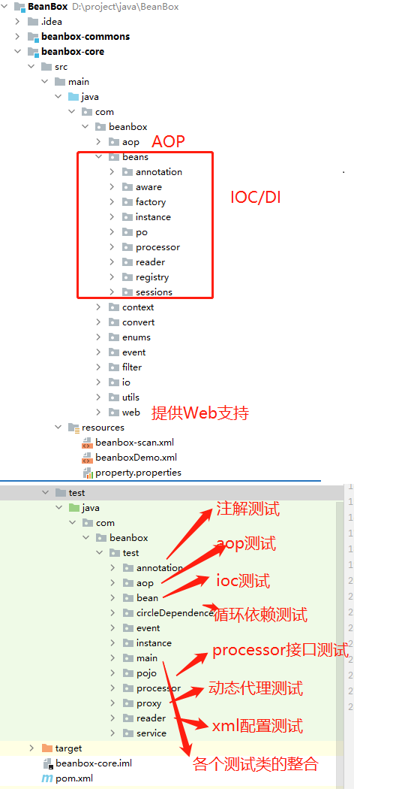

# beanbox
   BeanBox是一个功能齐全且兼容性很好的一款IOC/AOP工具，用于Java6或以上环境。除了实现了IOC, Aop这些主要功能之外, 该框架还提供了大量可对外扩展的接口，方便使用者在Bean对象的生命周期中能够对对象的状态进行管理和增强。此外，该框架能够很好的和其它框架进行兼容和拓展, 并且本框架搭配我的另一个开源项目fastrpc已经进行了测试。


### 一.BeanBox的主要优点

1. **功能齐全:** 

   该框架支持 XML配置、注解配置两种配置方式，解决了循环依赖问题和支持IOC/DI、AOP功能。

2. **拓展性好:**

   该框架提供了对外扩展的接口,使得框架使用者可以参与到IOC容器中保存对象的状态管理中.如: BeanDefinitionPostProcessor, BeanPostProcessor,AnnotationRegistryFactory等。

3. **兼容性强:**

   支持大多数JSR330、JSR250标准注解，并且可以和rpc等web框架兼容。

4. **源码简洁:**

    该框架在保持代码的架构清晰和简洁的基础上，实现了Spring所包含的大部分功能。


### 二.源码结构



### **三.Quick Start**

 此案例搭配我的另一个项目fastrpc进行展示: https://github.com/zyz610650/Fastrpc

  具体测试代码可见fastrpc:

`​`     **1>定义接口**

```java
/**
 * @author: @zyz
 */

public interface HelloService {

    String sayHi(User user);
}
```

   **2>RpcServer**

```java
/**
 * @author: @zyz
 *  version :服务版本
 *  group : 服务所在的组.主要用于处理一个接口有多个类实现的情况。
 */
@NoArgsConstructor
@RpcService(group = "G1",version = "v1.0.1")
public class HelloServiceImpl implements HelloService {
    static {
        System.out.println("HelloServiceImpl被创建");
    }
    @Override
    public String sayHi(User user) {
        return "Hello, I am "+user.getName();
    }
}


```

```java
@NoArgsConstructor
@RpcService(group = "G2",version = "v1.0.1")
public class HiServiceImpl implements HelloService {
    static {
        System.out.println("HelloServiceImpl被创建");
    }

    @Override
    public String sayHi(User user) {
        return "Hi, I am "+user.getName();
    }
}
```

```java
/**
 * @author: @zyz
 * fastrpc 配合框架使用,fastrpc会随着项目启动而自动运行
 */
@Slf4j
public class ApplicationServerMain {

    public static void main(String[] args) throws InterruptedException {
        //fastRpc会随着BeanBox框架加载而启动
       ClassPathXmlApplicationContext applicationContext=new ClassPathXmlApplicationContext ("classpath:beanbox.xml");
        log.debug ("rpc start");
        // 测试时防止fastrpc框架会随着主线程结束而结束
         Thread.sleep (100000);
    }
}

```

**beanbox.xml**

```xml
<?xml version="1.0" encoding="UTF-8"?>
<beans>

<!--    annotation注册器 用于添加自定义注解  annotationRegistryFactory为固定名称-->
    <bean id="annotationRegistryFactory"  class="com.fastrpc.web.AnnotationRegister"/>

<!--    Bean processor接口-->
    <bean class="com.fastrpc.web.MyBeanPostProcessor"/>

<!--    Bean-->
    <bean-scan base-package="com.fastrpc"/>


</beans>
```


**3>RpcClient**

```java
/**
 * @author: @zyz
 */
@Bean
public class HelloController {


    @RpcReference(group = "G2",version = "v1.0.1")
    private static HelloService helloService;
    @RpcReference(group = "G1",version = "v1.0.1")
    private static HelloService hiService;

    public  void sayHi()
    {
        User user=new User();
        user.setName("zyz");
        System.out.println (helloService.sayHi(user));
        user.setName("mzd");
        System.out.println (hiService.sayHi(user));

    }


}
```

```java
/**
 * @author: @zyz
 */

public class ApplicationClintMain {
   public static void main(String[] args) throws InterruptedException {
     ClassPathXmlApplicationContext applicationContext=new ClassPathXmlApplicationContext ("classpath:beanbox.xml");
      HelloController helloController= (HelloController) applicationContext.getBean("helloController");
      helloController.sayHi();
   }
}
```

**beanbox.xml**

```java
<?xml version="1.0" encoding="UTF-8"?>

<beans>
<!--  annotation注册器-->
    <bean class="com.fastrpc.web.MyBeanPostProcessor"/>

<!--bean 扫描路径-->
    <bean-scan base-package="com.fastrpc"/>


</beans>
```


**4>自定义注解**

​	实现 AnnotationRegistryFactory 接口, 添加自定义注解

```java
/**
 * @author: @zyz
 */
public class AnnotationRegister extends AbstractDefaultAnnotationRegistryFactory {

	@Override
	public void registAnnotations () {
		super.addAnnotation (new AnnotationType (RpcService.class));
	}
}

```


**5>参与管理Bean的状态**

实现BeanPostProcessor接口，对Bean的状态进行拓展

```java
/**
 * @author: @zyz
 */
@Slf4j
public class MyBeanPostProcessor implements BeanPostProcessor {
	private final RegistryService registryService = SingletonFactory.getInstance(RegistryServiceImpl.class);
	private final RpcRequestTransportService rpcRequestTransportService=SingletonFactory.getInstance(RpcRequestTransportServiceImpl.class);
	@Override
	public Object postProcessBeforeInitialization(Object bean, String beanName) throws BeanException {

		Class<?> clazz=bean.getClass();

		if (clazz.isAnnotationPresent(RpcService.class))
		{
			log.info("[{}] is annotated with  [{}]", clazz.getName(), RpcService.class.getCanonicalName());
			RpcService rpcService = clazz.getAnnotation(RpcService.class);

			RpcServiceConfig rpcServiceConfig=RpcServiceConfig.builder()
					.group(rpcService.group())
					.version(rpcService.version())
					.service(bean)
					.build();
			//向注册中心发布服务
			registryService.registerRpcService(rpcServiceConfig.getRpcServcieName());

			//添加Bean缓存
			ProxyFactory.CACHE_BEAN.put(rpcServiceConfig.getRpcServcieName(),bean);
			log.info("refister to zookeeper :[{}]",rpcServiceConfig.getRpcServcieName());
		}
		return bean;
	}

	@Override
	public Object postProcessAfterInitialization(Object bean, String beanName) throws BeanException {
		Class<?> clazz=bean.getClass();
		for(Field field: clazz.getDeclaredFields())
		{
			if (field.isAnnotationPresent(RpcReference.class))
			{
				RpcReference rpcReference=field.getAnnotation(RpcReference.class);

				RpcServiceConfig rpcServiceConfig=RpcServiceConfig.builder()
						.version(rpcReference.version())
						.group(rpcReference.group())
						.service(field.getType ())
						.build();
				RpcClientProxy rpcClientProxy=new RpcClientProxy(rpcServiceConfig,rpcRequestTransportService);
				Object clientProxy = rpcClientProxy.getProxy(field.getType ());
				field.setAccessible(true);
				try {
					field.set(bean,clientProxy);
				} catch (IllegalAccessException e) {
					throw new RpcException (e);
				}
			}
		}
		return bean;
	}
}
```

**6>结果**

```java
Hi, I am zyz

Hello, I am mzd
```


### 三.配置文件：

  具体测试Demo可以见代码test模块

1. **beanbox.xml:**

```xml
<?xml version="1.0" encoding="UTF-8"?>
<beans>

<!--    循环依赖测试-->
    <bean id="wife" class="com.beanbox.test.circleDependence.Wife">
        <property name="name" value="wife"/>
        <property name="husband" ref="husband"/>
    </bean>
    <bean id="husband" class="com.beanbox.test.circleDependence.Husband">
        <property name="name" value="husband"/>
        <property name="wife" ref="wife"/>
    </bean>
    <bean class="com.beanbox.aop.proxy.DefaultAdvisorAutoProxyCreator"/>
    <bean id="beforeAdvice" class="com.beanbox.test.circleDependence.aop.SpouseAdvice"/>
    <bean id="methodInterceptor" class="com.beanbox.aop.interceptor.MethodBeforeAdviceInterceptor">
           <property name="advice" ref="beforeAdvice"/>
     </bean>
        <bean id="pointcutAdvisor" class="com.beanbox.aop.advisor.AspectJExpressionPointcutAdvisor">
            <property name="expression" value="execution(* com.beanbox.test.circleDependence.Wife.*(..))"/>
            <property name="advice" ref="methodInterceptor"/>
        </bean>

<!--    占位符赋值测试-->
    <bean id="userService" class="com.beanbox.test.pojo.UserService" scope="prototype">
        <property name="uId" value="zyz"></property>
        <property name="uId" value="zyz"></property>
        <property name="company" value="jlu"></property>
        <property name="location" value="changchun"></property>
        <property name="token" value="${token}"/>
        <!--        <property name="userDao" ref="proxyUserDao"></property>-->
    </bean>


<!--    Annotation test-->
    <bean name="higherUser1" class="com.beanbox.test.pojo.HigherUser">
        <property name="name" value="higherUser1"/>
    </bean>
    <bean name="higherUser2" class="com.beanbox.test.pojo.HigherUser">
        <property name="name" value="higherUser2"/>
    </bean>
    <bean class="com.beanbox.beans.processor.support.PropertyPlaceholderProcessor">
        <property name="location" value="classpath:property.properties"/>
    </bean>
    <bean-scan base-package="com.beanbox.test.pojo"/>


<!--    Aop test-->
    <bean id="userService" class="com.beanbox.test.pojo.UserService">
        <property name="uId" value="trqwedsadasffa54sfsd"/>
    </bean>
    <bean class="com.beanbox.aop.proxy.DefaultAdvisorAutoProxyCreator"/>
    <bean id="beforeAdvice" class="com.beanbox.test.aop.UserServiceBeforeAdvice"/>
    <bean id="methodInterceptor" class="com.beanbox.aop.interceptor.MethodBeforeAdviceInterceptor">
        <property name="advice" ref="beforeAdvice"/>
    </bean>
    <bean id="pointcutAdvisor" class="com.beanbox.aop.advisor.AspectJExpressionPointcutAdvisor">
        <property name="expression" value="execution(* com.beanbox.test.pojo.IUserService.*(..))"/>
        <property name="advice" ref="methodInterceptor"/>
    </bean>


<!--    prox test-->
    <bean id="userService" class="com.beanbox.test.pojo.UserService" scope="prototype">
    <property name="uId" value="zyz"></property>
        <property name="uId" value="zyz"></property>
        <property name="company" value="jlu"></property>
        <property name="location" value="changchun"></property>
        <property name="userDao" ref="proxyUserDao"></property>
    <bean name="proxyUserDao" class="com.beanbox.test.proxy.ProxyUserDao" ></bean>


<!--    Listener test-->
    <bean class="com.beanbox.test.event.CustomEventListener"></bean>
    <bean class="com.beanbox.test.event.ContextClosedEventListener"></bean>
    <bean class="com.beanbox.test.event.ContextRefreshedEventListener"></bean>


<!--    Processor Test-->
    <bean id="userService2" class="com.beanbox.test.service.UserService2">
        <!--          <property name="user" ref="user"></property>-->
    </bean>
    <bean id="user" class="com.beanbox.test.pojo.User">
        <property name="name" value="zyz"/>
        <property name="age" value="12"></property>
        <property name="higherUser" ref="higherUser"/>
    </bean>
    <bean id="higherUser" class="com.beanbox.test.pojo.HigherUser"/>
    <bean class="com.beanbox.test.processor.MyBeanDefinitionPostProcessor"/>
    <bean class="com.beanbox.test.processor.MyBeanProcessor"/>

    <bean id="userDao" class="com.beanbox.test.pojo.UserDao" init-method="initDataMethod" destory-method="destroyDataMethod"/>
    <bean id="userBean" class="com.beanbox.test.pojo.UserBean" />

</beans>
```

2. **web.xml**

```xml
<?xml version="1.0" encoding="UTF-8"?>
<web-app xmlns="http://xmlns.jcp.org/xml/ns/javaee"
         xmlns:xsi="http://www.w3.org/2001/XMLSchema-instance"
         xsi:schemaLocation="http://xmlns.jcp.org/xml/ns/javaee http://xmlns.jcp.org/xml/ns/javaee/web-app_4_0.xsd"
         version="4.0">
	
 <!--    beanbox 中定义的监听器 用于启动BeanBox框架-->
    <listener>
        <listener-class>com.beanbox.web.WebAppEventListener</listener-class>
    </listener>
</web-app>
```

